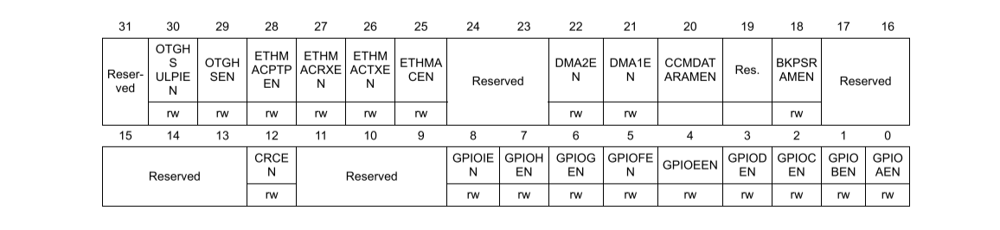

# Programação em CMSIS

- [Configurar o ADC](#Configurando-o-ADC)
- [Usar o ADC](#Usando-o-ADC)

# Configurando o ADC

Para configurar o ADC para o uso, seguimos os seguinte passos:

- [Habilitar o clock do ADC](#Habilitando-o-Clock-do-ADC)
- [Configurar o Modo do Pino](#Configurando-o-Modo) 
- [Configurar o clock do ADC](#Configurando-o-clock-do-ADC) 
- [Definir Resolução do ADC e Scan Mode](#Definindo-Resolução-do-ADC-e-Scan-Mode)
- [Definir sequencia de conversão](#Definindo-sequencia-de-conversão)
- [Definir tempo de amostragem](#Definir-tempo-de-amostragem)

## Habilitando o Clock do ADC

É feito usando o Módulo RCC(Reset and clock control) e o registrador que habilita o clock
no barramento APB2 que é o barramento de alta velocidade, porém mais lento que o AHB1, nele
é onde os ADCs estão conectados.

O Registrador é chamado de APB2ENR e com ele podemos habilitar e configurar alguns periféricos.
Os ADCs são habilitados em ordem alfabetica do bit 8 ao bit 10.

Para por exemplo habilitar o ADC1, podemos escrever o seguinte:  
`RCC->APB2ENR |= 0x0100`

Isso irá habilitar apenas o ADC1 sem interferir em nenhuma outra configuração.

## Configurando o Modo

É necessario configurar o Pino do GPIO para Analogico, para isso devemos habilitar
o clock no GPIOx e depois colocar usando o registrador MODER o pino como Analogico.

Exemplo de código:  
`RCC->AHB1ENR |= 0x01`

Nesse registrador cada par de bits representa o modo do bit em questão, estes modos
podem ser:

- 00 -> INPUT (Entrada)
- 01 -> OUTPUT (Saída)
- 10 -> FUNCTION (Função)
- 11 -> ANALOG (Analógica)

Para definir o pino 0 do GPIOA como Analógico, pode ser feito da seguinte forma:  
`GPIOA->MODER |= 0x0003 // em binário ficaria assim -> 0b00000011`

## Configurando o clock do ADC

O clock do ADC é proveniente do APB2, porém pode ser dividido usando o preescaler
do ADC, para configurar o preescaler devemos usar os bits 16 e 17 do registrador CCR do módulo ADC

- 00 -> divide o clock por 2
- 01 -> divide o clock por 4
- 10 -> divide o clock por 6
- 11 -> divide o clock por 8
  
Dividindo o clock por 4.  
`ADC->CCR |= 0x10000`

## Definindo Resolução do ADC e Scan Mode

Para converter as tensões passadas na entrada o ADC pode utilizar
diferentes resoluções, a resolução vai definir a precisão do conversor
ela pode ser de 12, 10, 8 e 6 bits.

Para configurar utilizamos os bits 24 e 25 do registrador CR1 do módulo
ADCx.

- 00 -> 12 bits
- 01 -> 10 bits
- 10 -> 8 bits
- 11 -> 6 bits

Exemplo de configuração para 8 bits de resolução:  
`ADCx->CR1 |= 0x02000000`

### Scan Mode

O Scan mode faz com que as entradas programadas nos registradores ADC_SQRx ou ADC_JSQRx sejam
convertidas. Para habilitar escrevemos no bit 8 do registrador CR1:

`ADCx->CR1 |= 0x0100`

## Definindo sequencia de conversão

Existem vários modos de conversão: conversão única, conversão contínua(uso de DMA), sequencial única,
sequencial contínua(uso de DMA).

Para converter uma ou uma determinada sequencia devemos configura-la, mas antes disso
precisamos desligar o ADC, fazemos isso usando o bit 0 do CR2 do módulo ADCx

Exemplo de código:  
`ADCx->CR2 &= ~0x1`

### Configurar a quantidade de canais 

Para configurar a quantidade de canais de conversão usando o ADC_SQR1, no bit L  

Para uma única conversão é necessário.

### Configurar a sequencia

Para configurar a sequencia de conversão usamos os registrados SQR3, SQR2 e SQR1 do
módulo ADCx.

Isso é usado para definir a sequencia para o dma, mas para conversão única, podemos
definir no SQR3 nos primeiros 5 bits o canal que iremos utilizar, por exemplo:  
`ADCx->SQR3 |= 0x01   // Define o canal 1`

### Definir tempo de amostragem

Depois devemos configurar o tempo de Sampling dos canais, usando os registradores
SMPR1 e SMPR2:

- 000 -> 3 ciclos de clock
- 001 -> 15 ciclos de clock
- 010 -> 28 ciclos de clock
- 011 -> 56 ciclos de clock
- 100 -> 84 ciclos de clock
- 101 -> 112 ciclos de clock
- 110 -> 144 ciclos de clock
- 111 -> 480 ciclos de clock

Definindo o tempo de 480 ciclos para o canal 0:  
`ADCx->SMPR2 |= 0x07`

Depois de configurar tudo, devemos ligar e esperar um tempo para estabilizar.

Exemplo de código:  

    ADCx->CR2 |= 0x1
    int delay = 10000
    while(delay--);

# Usando o ADC

Para usar o ADC devemos:  

- [Limpar Status Register](#Limpando-Status-Register)
- [Iniciar Conversão](#Iniciando-Conversão)
- [Esperar a Conversão](#Esperando-a-Conversão)
- [Ler a Conversão](#Lendo-a-Conversão)

## Limpando Status Register

Para podermos inicar a conversão devemos limpar o status register usando o 
Módulo ADCx e o registrador SR:

`ADCx->SR = 0`

## Iniciando Conversão

Para inicar a conversão usamos o Módulo ADCx e o bit 30 do registrador CR2:

`ADCx->CR2 |= 0x40000000`

## Esperando a Conversão

Criamos um loop para esperar até a conversão estar pronta para evitar problemas:  
`while(!(ADCx-SR & 0x1))`

## Lendo a Conversão

Depois lemos a conversão usando o registrador DR do módulo ADCx

`uint16_t leitura = ADCx->DR`
