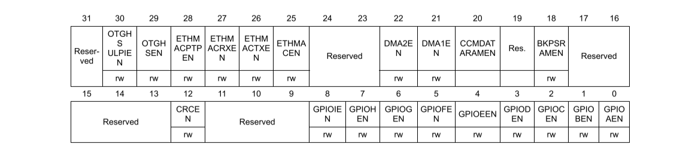
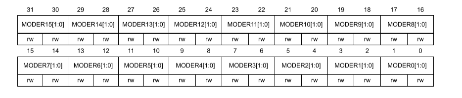
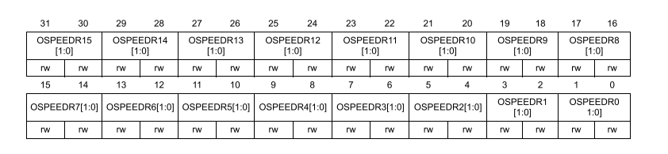
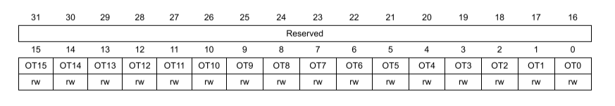
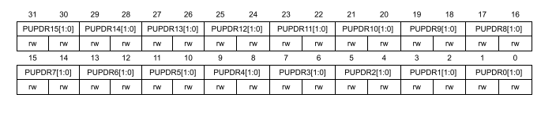
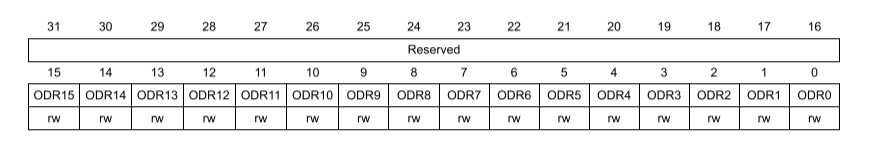
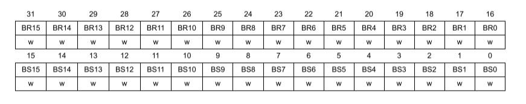
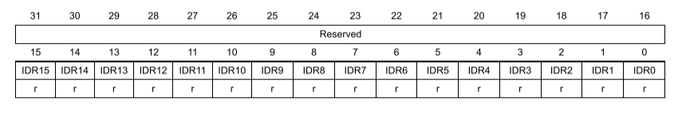

# Programação em CMSIS 

- [Configurar o GPIO](#Configurando-o-GPIO)
- [Usar o GPIO](#Usando-o-GPIO)

# Configurando o GPIO

Para configurar o gpio para o uso, seguimos os seguinte passos:

- [Habilitar o clock do GPIO](#Habilitando-o-Clock-do-GPIO)
- [Configurar o Modo do Pino](#Configurando-o-Modo) (lembrando que são do 0 ao 15)
- [Definir velocidade de Saída](#Definindo-a-velocidade-da-saída) (caso o modo for de saída)
- [Definir o tipo de saída](#Definindo-o-tipo-da-saída) (novamente se o modo for de saída)
- [Definir o resistor de pull up/down](#Configurando-o-Resistor-de-Pull-Up/Down)

## Habilitando o Clock do GPIO

É feito usando o Módulo RCC(Reset and clock control) e o registrador que habilita o clock
no barramento AHB1 que é o barramento de alta velocidade onde os GPIOs estão conectados.

O Registrador é chamado de AHB1ENR e com ele podemos habilitar e configurar alguns periféricos.
Os GPIOs são habilitados em ordem alfabetica do bit 0 ao bit 8.

Para por exemplo habilitar o GPIOA, podemos escrever o seguinte:  
`RCC->AHB1ENR |= 0x1`

Isso irá habilitar apenas o GPIOA sem interferir em nenhuma outra configuração.

## Configurando o Modo

É feito usando o modulo do GPIO em questão, e o registrador MODER

Nesse registrador cada par de bits representa o modo do bit em questão, estes modos
podem ser:

- 00 -> INPUT (Entrada)
- 01 -> OUTPUT (Saída)
- 10 -> FUNCTION (Função)
- 11 -> ANALOG (Analógica)

Para definir o pino 2 do GPIOA como saida, pode ser feito da seguinte forma:  
`GPIOA->MODER |= 0x0010 // em binário ficaria assim -> 0b00010000`

## Definindo a velocidade da saída

Podemos controlar o tempo em que a saída muda de estado, por exemplo de 0 para 1.

É feito usando o modulo do GPIO em questão, e o registrador OSPEEDR

Nesse registrador cada par de bits representa a velocidade do bit em questão, estas velocidades
podem ser:

- 00 -> Low Speed (Baixa Velocidade)
- 01 -> Medium Speed (Média Velocidade)
- 10 -> High Speed (Alta velocidade)
- 11 -> Very High Speed ("Extrema" velocidade)

Para definir o pino 2 do GPIOA como Extrema velocidade, pode ser feito da seguinte forma:  
`GPIOA->OSPEEDR |= 0x0030 // em binário ficaria assim -> 0b00110000`

> Obs: Quanto maior for a velocidade, maior será o ruído na transição de estado.

## Definindo o tipo da saída

Existem dois tipos de saída a push pull que é a padrão e a open drain. 

- Push Pull -> ambos os níveis lógicos são comutados, ou seja 0 -> 0V e 1 -> 3.3V
- Open Drain -> apenas um é comutado, por exemplo 0 -> 0V e 1 -> alta impedância.

É feito usando o modulo do GPIO em questão, e o registrador OTYPER

Nesse registrador cada bits representa o tipo da saída do pino em questão, estes tipos
podem ser:

- 0 -> Push Pull (Saída push pull)
- 1 -> Open Drain (Saída de dreno aberto)

Para definir o pino 2 do GPIOA como Open Drain, pode ser feito da seguinte forma:  
`GPIOA->OTYPER |= 0x0004 // em binário ficaria assim -> 0b00000100`

## Configurando o Resistor de Pull Up/Down

No pino em questão pode haver resistores de pull up e pull down internos. Para habilita-los
usamos o modulo do GPIO em questão, e o registrador PUPDR

Nesse registrador cada par de bits representa o Resistor que será habilitado do bit em questão, 
estes podem ser:

- 00 -> NO PULL UP/Down (Sem resistor de pull up/down)
- 01 -> Pull Up (Resistor de Pull Up)
- 10 -> Pull Down (Resistor de Pull Down)
- 11 -> Reserved (Reservado e não pode ser usado)

Para definir o pino 2 do GPIOA com um resistor de pull down, pode ser feito da seguinte forma:  
`GPIOA->PUPDR |= 0x0020 // em binário ficaria assim -> 0b00100000`

# Usando o GPIO

- [Escrever no Pino](#Escrevendo-no-Pino)
- [Ler o Pino](#Lendo-o-Pino)

## Escrevendo no Pino

Para escrever no pino podemos usar dois registrados o ODR e o BSRR.

Para escrever com o ODR atribuimos o nível que queremos no pino do registrador

Para setar o pino 6 para nivel logico alto podemos usar o seguinte código:  
`GPIOx->ODR |= 0x0040`

> Sendo que substituimos o 'x' pela letra do GPIO

O BSRR é diferente, ele pode ser separado em duas partes de 16 bits, a primeira reseta o pino e a segunda
seta o pino para nivel logico alto

Para setar o pino 6 para nivel logico alto podemos usar o seguinte código:  
`GPIOx->BSRR = 0x0040`  

E para resetar:  
`GPIOx->BSRR = 0x00400000`

## Lendo o Pino

Para ler o pino podemos usar o registrado IDR, ele irá retornar o nível lógico de todos os pinos,
e é interessante usar uma máscara para que fique apenas aqueles que desejamos.

Podemos usar o seguinte código para ler o pino 6:  
`uint16_t leitura = (GPIOx->IDR & 0x0040)`
