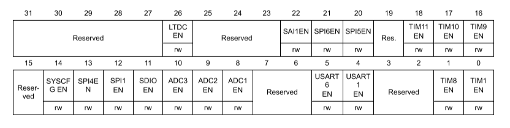

# Programação em CMSIS 

- [Configurar o Usart](#Configurando-o-Usart)
- [Usar a Usart](#Usando-a-Usart)

# Configurando o Usart

Para configurar o Usart para o uso, seguimos os seguinte passos:

- [Habilitar o clock da_Usart](#Habilitando-o-Clock-da_Usart)
- [Configurar o Modo do Pino](#Configurando-o-Modo)
- [Configurar Baud rate](#Configurando-Baud-rate)
- [Iniciar Usart](#Iniciando-Usart) 

## Habilitando o Clock da Usart

É feito usando o Módulo RCC(Reset and clock control) e o registrador que habilita o clock
no barramento APB1 ou APB2 dependendo da Usart.

Os Registradores são chamados de APB1ENR e APB2ENR com eles podemos habilitar e configurar alguns periféricos.
As Usarts são habilitados do bit 17 ao bit 20 do APB1ENR e bits 4 e 5 do APB2ENR.

Para por exemplo habilitar a Usart 2, podemos escrever o seguinte:  
`RCC->APB1ENR |= 0x20000`

Isso irá habilitar apenas a Usart 2 sem interferir em nenhuma outra configuração.

## Configurando o Modo

É feito usando o modulo do GPIO em questão, e o registrador MODER. Mas antes precisamos abilitar o clock
do GPIO em questão.

Usando o RCC AHB1ENR:

Depois configuramos o Modo, usando o GPIOx->MODER.

No registrador Moder cada par de bits representa o modo do bit em questão, estes modos
podem ser:

- 00 -> INPUT (Entrada)
- 01 -> OUTPUT (Saída)
- 10 -> FUNCTION (Função)
- 11 -> ANALOG (Analógica)

Devemos colocar como função auxiliar.

Depois devemos configurar a função que irá receber, isto é feito usando 2 registradores o AFRH
e o AFRL, sendo o L a parte dos bits menos significativos e o H os mais significativos.

Para definir as funções de cada pino usamos 4 bits, que podem ser

- 0000 -> AF0
- 0001 -> AF1
- 0010 -> AF2
- 0011 -> AF3
- 0100 -> AF4
- 0101 -> AF5
- 0110 -> AF6
- 0111 -> AF7
- 1000 -> AF8
- 1001 -> AF9
- 1010 -> AF10
- 1011 -> AF11
- 1100 -> AF12
- 1101 -> AF13
- 1110 -> AF14
- 1111 -> AF15

As funções são:

Para definir o pino PA2 e PA3 como Usart, pode ser feito da seguinte forma:  

    GPIOA->MODER |= 0x00A0 // em binário ficaria assim -> 0b10100000
    GPIOA->AFRL |= 0x7700 // em binário ficaria assim -> 0b0111011100000000

## Configurando Baud rate

Para configurar o Baud rate usamos o registrador BRR do módulo Usartx

O registrador é separado em duas partes a mantissa e a fraction. A mantissa representará 
a parte inteira e a fraction a fração.

Para calcularmos o baud rate devemos dividir o clock do APB que estamos usando pelo oversampling e o
baud rate que queremos.

Ex: `16000000 / (oversampling * 96000)`

O oversampling é a taxa de amostragem que será usada para definir o bit. Se usarmos oversampling de 8, o
stm32 irá utilizar 8 sinais de clock para definir o bit, se usarmos oversampling de 16 ele usará 16 sinais 
de clock. Isso serve para reduzir erros provenientes de ruídos, pois em vez dele ler uma vez apenas, ele lê
várias e usa o sinal que apareceu mais vezes, exemplo: 1011, ele lerá como 1 e ativará a flag de ruído NE.

O stm32 pode trabalhar com 2 oversamplings, o de 8 e o de 16, por padrão ele usa o de 16. Para setar o oversampling
de 8 usamos o bit 15 do registrador CR1 do Módulo Usartx.

Então com o oversampling padrão de 16 e o clock padrão de 16MHz usando o baud rate de 9600, temos:

Ex: `float div = 16000000 / (16.0 * 9600) // div será igual a 104.16667`

A parte inteira será colocada na mantissa:  
`Usart2->BRR |= ((int) div ) << 4 // deslocado de 4 para ele ficar na parte da mantissa`

A parte fracionaria devemos multiplicar por 16 e arredondar. Para isso podemos somar 0.5 e truncar para inteiro, pois
ao truncar ele sempre "arredonda" para baixo.

`Usart2->BRR |= (int) (((div - (int) div) * 16) + 0.5)` 

Assim configuramos o baud rate de 9600 para Usart2.

## Iniciando Usart

Usando o Registrador CR1 do módulo Usartx, iremos ativar o tx, rx e por fim a própria Usart.

Para ativar usaremos os bits 2, 3 e 13.

Em código ficaria:  
`Usartx->CR1 |= 0x200C // em binário: 0b0010000000001100`

# Usando a Usart

- [Ler os Dados](#Lendo-os-Dados)
- [Escrever os Dados](#Escrevendo-os-Dados)

## Lendo os Dados

Para lermos usamos o registrador DR, mas antes precisamos verificar se o dado foi recebido e esperar. Para 
isso usamos o registrador SR do módulo Usartx.

Verificamos o bit 5 do registrador SR, e se ele estiver setado, fazemos a leitura.

Exemplo de código:

        while(!(USART2->SR & 0x20));
        int leitura = USART->DR;

## Escrevendo os Dados

Para escrevermos faremos algo semelhante a operação de leitura, em que esperaremos a flag de que os dados já 
foram para shift register, e que podemos inserir mais dados, usando o registrador SR

Verificamos o bit 7 do registrador SR, e se ele estiver setado, fazemos a escrita. Lembrando que é bom utilizar
char para a escrita.

Exemplo de código:

        while(!(USART2->SR & 0x80));
        USART->DR = (char & 0xFF);
