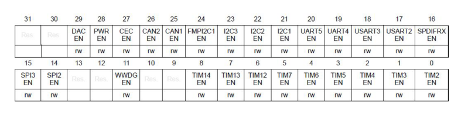

# Programação em CMSIS 

- [Configurar o Usart](#Configurando-o-Usart)
- [Usar o Usart](#Usando-o-Usart)

# Configurando o Usart

Para configurar o Usart para o uso, seguimos os seguinte passos:

- [Habilitar o clock da_Usart](#Habilitando-o-Clock-da_Usart)
- [Configurar o Modo do Pino](#Configurando-o-Modo)
- [Configurar Baud rate](#Configurando-Baud-rate)
- [Iniciar Usart](#Iniciando-Usart) 

## Habilitando o Clock da Usart

É feito usando o Módulo RCC(Reset and clock control) e o registrador que habilita o clock
no barramento APB1 que é o barramento de baixa velocidade onde as Usarts estão conectadas.

O Registrador é chamado de APB1ENR e com ele podemos habilitar e configurar alguns periféricos.
As Usarts são habilitados do bit 17 ao bit 20.

Para por exemplo habilitar a Usart 2, podemos escrever o seguinte:  
`RCC->APB1ENR |= 0x20000`

Isso irá habilitar apenas a Usart 2 sem interferir em nenhuma outra configuração.

## Configurando o Modo

É feito usando o modulo do GPIO em questão, e o registrador MODER. Mas antes precisamos abilitar o clock
do GPIO em questão.

Usando o RCC AHB1ENR:

Depois configuramos o Modo, usndo o GPIOx->MODER.

No registrador Moder cada par de bits representa o modo do bit em questão, estes modos
podem ser:

- 00 -> INPUT (Entrada)
- 01 -> OUTPUT (Saída)
- 10 -> FUNCTION (Função)
- 11 -> ANALOG (Analógica)

Devemos colocar como função auxiliar.

Depois devemos configurar a função que irá receber, isto é feito usando 2 registradores o AFRH
e o AFRL, sendo o L a parte dos bits menos significativos e o H os mais significativos.

Para definir as funções de cada pino usamos 4 bits, que podem ser

- 0000 -> AF0
- 0001 -> AF1
- 0010 -> AF2
- 0011 -> AF3
- 0100 -> AF4
- 0101 -> AF5
- 0110 -> AF6
- 0111 -> AF7
- 1000 -> AF8
- 1001 -> AF9
- 1010 -> AF10
- 1011 -> AF11
- 1100 -> AF12
- 1101 -> AF13
- 1110 -> AF14
- 1111 -> AF15

As funções são:

Para definir o pino PA2 e PA3 do como Usart, pode ser feito da seguinte forma:  

    GPIOA->MODER |= 0x00A0 // em binário ficaria assim -> 0b10100000
    GPIOA->AFRL |= 0x7700 // em binário ficaria assim -> 0b0111011100000000

## Configurando Baud rate

